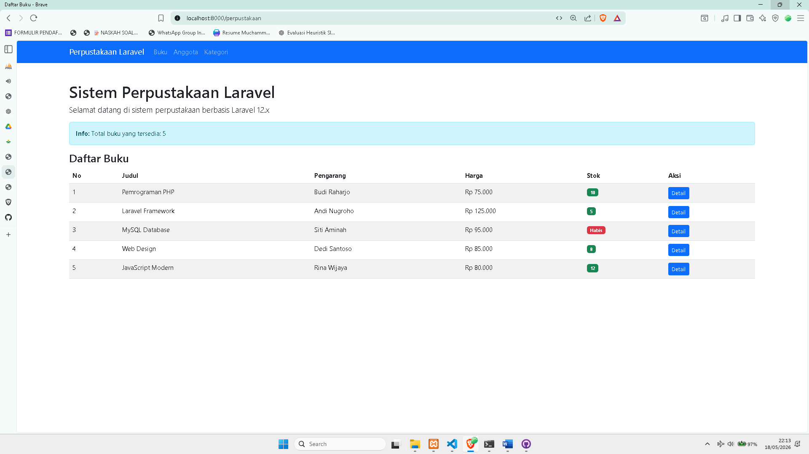
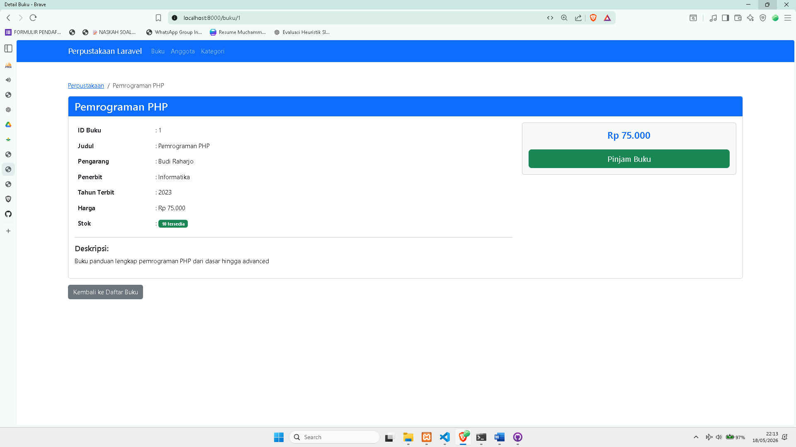
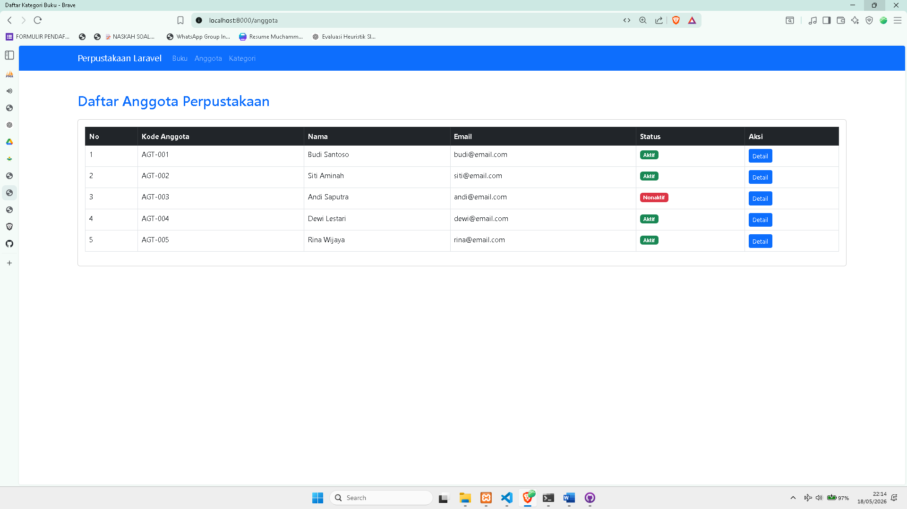
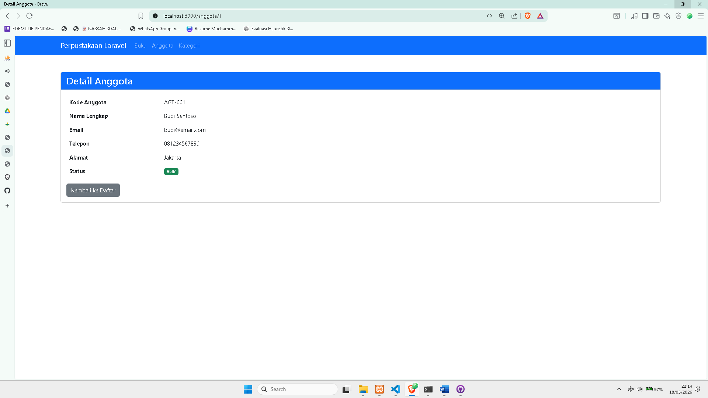
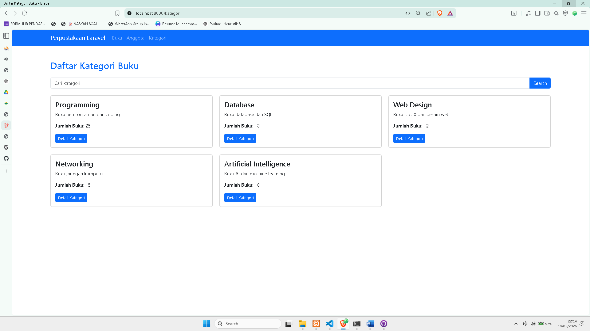
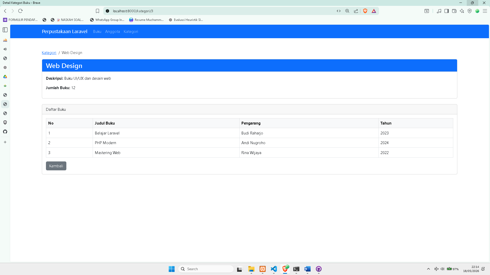

# Sistem Perpustakaan Laravel

Project ini merupakan implementasi dasar framework Laravel menggunakan konsep MVC (Model View Controller). Aplikasi mencakup fitur pengelolaan buku, anggota perpustakaan, kategori buku, dan pencarian kategori.

---

# Fitur Project

## 1. Manajemen Buku

* Menampilkan daftar buku
* Menampilkan detail buku
* Informasi stok buku
* Tampilan menggunakan Bootstrap 5

## 2. Manajemen Anggota

* Menampilkan daftar anggota perpustakaan
* Detail anggota
* Status anggota aktif/nonaktif

## 3. Manajemen Kategori

* Menampilkan daftar kategori buku
* Detail kategori
* Daftar buku berdasarkan kategori
* Fitur pencarian kategori

## 4. Layout Laravel

* Menggunakan master layout Blade
* Navbar global
* Menggunakan @extends dan @section

---

# Teknologi yang Digunakan

* Laravel 12
* PHP 8.2
* Bootstrap 5

---

# Struktur Folder

```bash
app/
 └── Http/
      └── Controllers/
           ├── PerpustakaanController.php
           └── KategoriController.php

resources/
 └── views/
      ├── layouts/
      │    └── app.blade.php
      │
      ├── perpustakaan/
      │    ├── index.blade.php
      │    ├── show.blade.php
      │    └── about.blade.php
      │
      ├── anggota/
      │    ├── index.blade.php
      │    └── show.blade.php
      │
      └── kategori/
           ├── index.blade.php
           ├── show.blade.php
           └── search.blade.php
```

---


# Screenshot Project

## 1. Tampilan Awal
---

---

## 2. Daftar Buku
---

---

## 3. Daftar Anggota
---

---

## 5. Detail Anggota
---

---

## 6. Daftar Kategori
---

---

## 7. Detail Kategori
---

---

